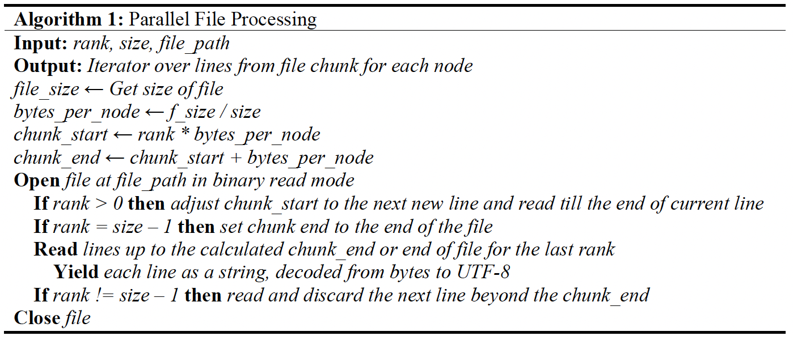
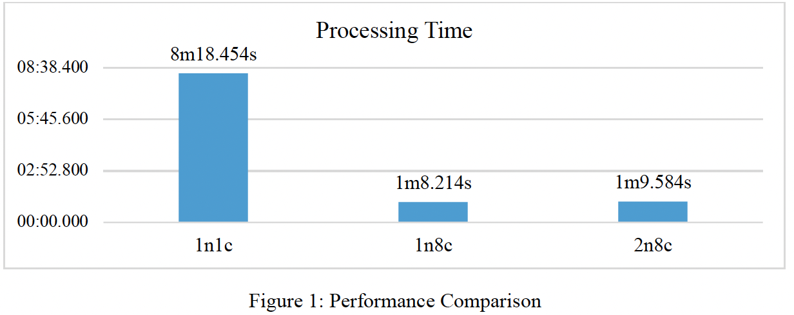
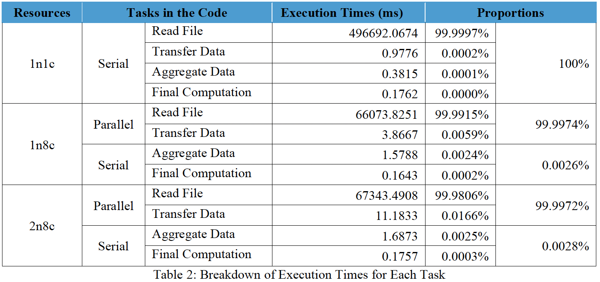

# Twitter HPC Parallel Processing

A scalable high-performance computing (HPC) pipeline for processing **120GB of Twitter data** using **Python (mpi4py)** on a Linux cluster (SPARTAN). This project demonstrates distributed data processing, efficient file chunking, and parallel computation for large-scale analytics.

---

## Overview

This project implements a **parallel data processing system** to analyse large-scale Twitter datasets and identify:

* Most active hours and days
* Highest sentiment periods
* Temporal patterns in social media activity

The system is designed to handle **massive JSON datasets efficiently** by combining:

* Chunk-based file segmentation
* MPI-based parallel processing
* Vectorised computation using NumPy

---

## Architecture

### Parallel File Processing Algorithm



Each processor:

1. Reads a specific chunk of the file
2. Adjusts boundaries to avoid partial JSON records
3. Processes data independently
4. Sends results to the master node for aggregation

---

## Performance Results

### Processing Time Comparison
<p align="center">
  
</p>
👉 Achieved **~7× speedup** through parallelisation.

---

### Execution Time Breakdown

<p align="center">
  
</p>

* Over 99.99% of runtime is parallelisable
* Minimal overhead from communication and aggregation
* Performance closely aligns with **Amdahl’s Law**

---

## Project Structure

```text
twitter-hpc-parallel-processing/
├── src/
│   ├── main.py                     # Entry point
│   ├── hpc_parallel_processor.py  # Core MPI logic
│   └── io_utils.py                # File handling and parsing
│
├── scripts/                       # SLURM job scripts
├── experiments/                   # Experimental implementations
├── results/                       # Output logs
├── docs/                          # Visualisations and diagrams
```

---

## How to Run

### Local (single process)

```bash
python -m src.main
```

### HPC (MPI execution)

```bash
mpiexec -n 8 python -m src.main
```

### SLURM

```bash
sbatch scripts/1n8c.slurm
```

---

## Key Features

* Efficient **chunk-based file reading** for large JSON datasets
* MPI-based **distributed processing (SPMD model)**
* Optimised aggregation using NumPy arrays
* Designed for **low memory footprint and high throughput**

---

## Technologies Used

* Python
* mpi4py (MPI for Python)
* NumPy
* Linux / Bash
* SLURM (job scheduling)

---

## Results

* Processed **120GB dataset** on HPC cluster
* Reduced runtime from ~8 minutes (single core) to ~1 minute (parallel)
* Achieved near-optimal scaling given communication overhead

---

## Future Improvements

* Custom MPI reduction operations for further optimisation
* Dynamic memory allocation for variable time ranges
* Extension to streaming or real-time processing pipelines

---

## License

This project is licensed under the MIT License.